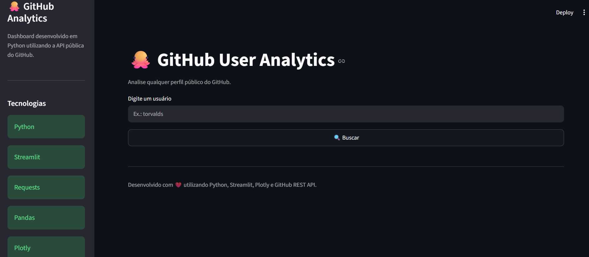
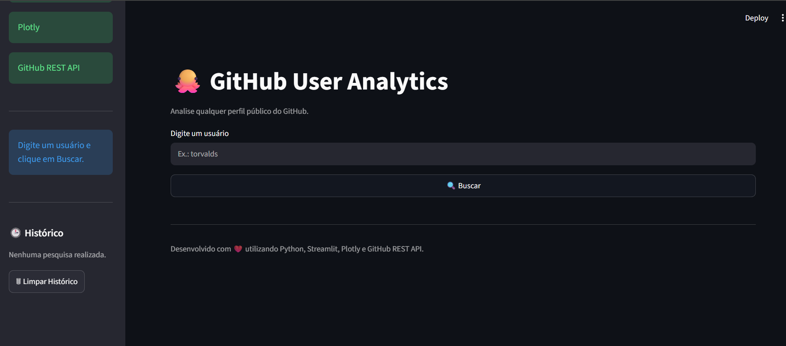
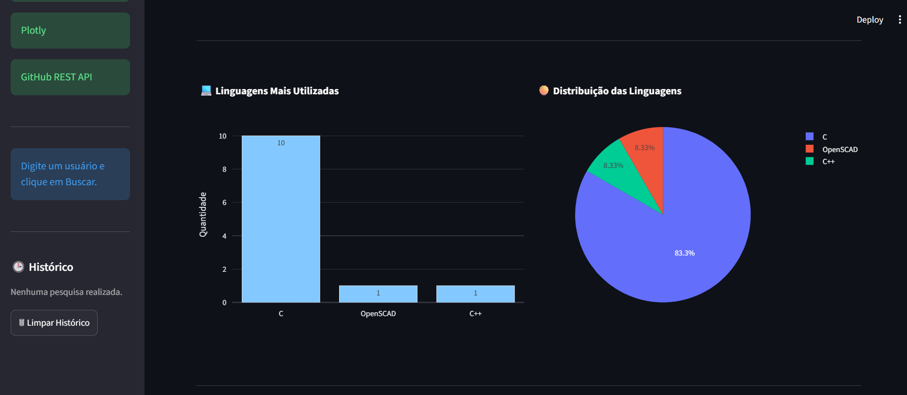
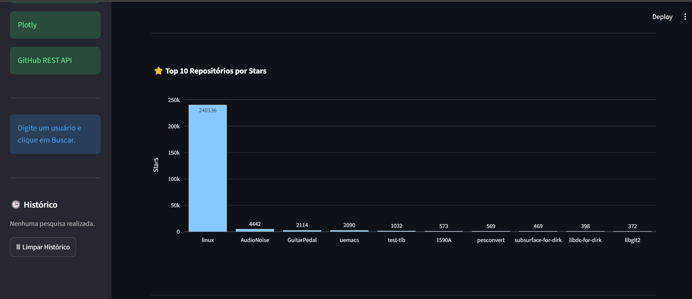
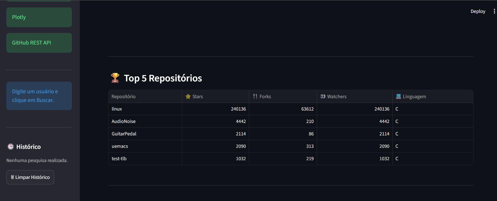
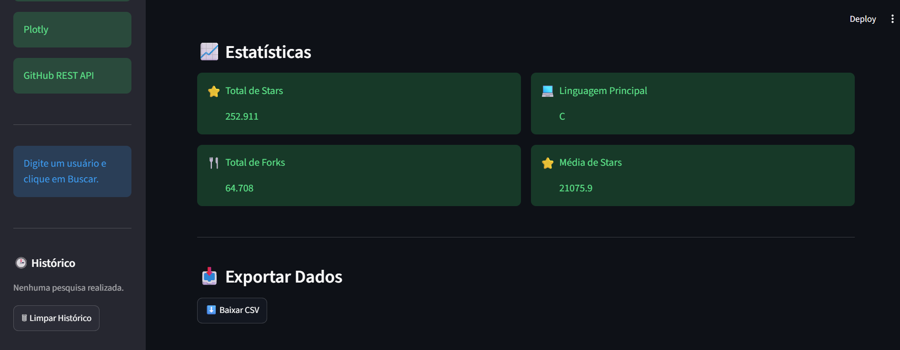

# 🐙 GitHub User Analytics

Dashboard interativo desenvolvido em **Python** para analisar qualquer perfil público do GitHub utilizando a **GitHub REST API**. O sistema coleta informações em tempo real, gera estatísticas, gráficos interativos e permite exportar os dados dos repositórios para CSV.

---

# 📌 Objetivo

Este projeto foi desenvolvido para demonstrar habilidades em:

- Consumo de APIs REST
- Desenvolvimento de aplicações Web com Streamlit
- Manipulação e análise de dados com Pandas
- Visualização de dados com Plotly
- Organização de projetos Python em módulos
- Exportação de dados para CSV

---

# 🚀 Funcionalidades

- 🔍 Buscar qualquer usuário público do GitHub
- 👤 Exibir informações do perfil
- 👥 Quantidade de seguidores
- 📦 Total de repositórios públicos
- ⭐ Total de estrelas recebidas
- 🍴 Total de forks
- 🏆 Repositório com maior número de estrelas
- 💻 Ranking das linguagens utilizadas
- 📊 Dashboard com gráficos interativos
- 📈 Estatísticas automáticas
- 📅 Tempo de existência da conta
- 📥 Exportação dos dados para CSV
- 🕒 Histórico das pesquisas realizadas
- 🔗 Botão para abrir o perfil diretamente no GitHub

---

## 📊 Dashboard





---

## 📈 Gráficos









---

## 🎥 Demonstração


---

# 📁 Estrutura do Projeto

```text
GitHub-User-Analytics/
│
├── app.py
├── requirements.txt
├── README.md
├── .gitignore
│
├── src/
│   ├── analytics.py
│   ├── charts.py
│   ├── exporter.py
│   ├── formatter.py
│   ├── github_api.py
│   ├── statistics.py
│   ├── ui.py
│   └── __init__.py
│
├── assets/
│   ├── images/
│   └── gifs/
│
└── output/
```

---

# ⚙️ Instalação

Clone o repositório

```bash
git clone https://github.com/seuusuario/GitHub-User-Analytics.git
```

Entre na pasta

```bash
cd GitHub-User-Analytics
```

Crie um ambiente virtual

```bash
python -m venv .venv
```

Ative o ambiente

### Windows

```bash
.venv\Scripts\activate
```

### Linux / macOS

```bash
source .venv/bin/activate
```

Instale as dependências

```bash
pip install -r requirements.txt
```

Execute o projeto

```bash
streamlit run app.py
```

---

# 📊 Exemplo de Resultado

| Usuário   | Seguidores | Repositórios | Linguagem Principal |
| --------- | ---------: | -----------: | ------------------- |
| torvalds  |   311.000+ |           12 | C                   |
| microsoft |   Milhares |     Centenas | C#                  |
| google    |   Milhares |     Centenas | C++                 |
| openai    |   Milhares |      Dezenas | Python              |

---

# 🛠 Tecnologias Utilizadas

- Python
- Streamlit
- Requests
- Pandas
- Plotly
- GitHub REST API

---

# 📦 Bibliotecas

```text
streamlit
requests
pandas
plotly
```

---

# 🎯 Principais Aprendizados

Durante o desenvolvimento deste projeto foram aplicados conceitos de:

- Consumo de APIs REST
- Organização modular de aplicações Python
- Manipulação de JSON
- Tratamento de erros
- Análise de dados
- Visualização de dados
- Exportação para CSV
- Interface Web com Streamlit

---

# 📈 Possíveis Melhorias

- Autenticação via Token do GitHub
- Comparação entre dois usuários
- Dashboard de organizações
- Evolução temporal dos repositórios
- Filtros por linguagem
- Exportação para Excel e PDF

---

# 👨‍💻 Autor

Desenvolvido por **Davi Santos**.

Se este projeto foi útil, deixe uma ⭐ no repositório.
